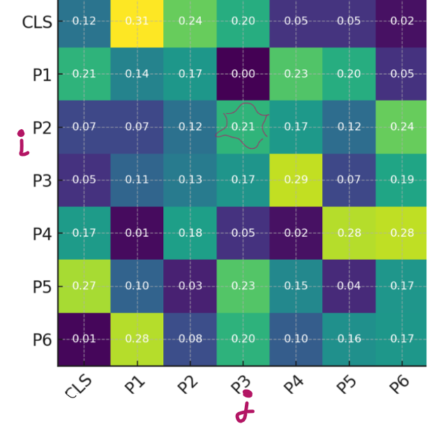
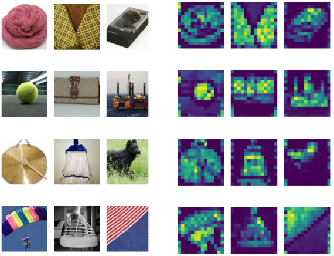

[In the previous note](vit.md), we looked at how the Vision Transformer works. Let's discuss how to see attention maps of ViT.

## How to get

Imagine, we have ViT final layer in Transformer Encoder block. In this final layer we have $h$ heads. From each head we can take:

$$
A = softmax \left( \frac{QK^T}{\sqrt{d_K}} \right)
$$
$$A$$ has shape $$N+1 \; \times \; N+1$$
$$N$$ - number of patches
For 1 CLS token is responsible

We can take only specific head or mean $$A$$ across all the $$h$$ heads. So, for simplicity, imagine that we have only one matrix $$A$$.

## What does A mean?

The attention map $$A$$ is matrix showing the attention weights each token pays to every other token.

For example, look at simlified example of such $$A$$:

Sequence of tokens for $$A$$ above:

$$
CLS, P1, P2, P3, P4, P5, P6
$$

What does it mean?

Each element $$a_{ij} \in [0, 1]$$ of the attention matrix $$A$$ measures the attention score of $$P_i$$ to $$P_j$$.

Each line corresponds to a token from the sequence. Take a specific line, for example $$i$$. On this line, you can see the importance of all the tokens in the sequence with respect to token $$i$$ (including $$i$$–$$i$$). In other words, how token $$i$$ attends to token $$j$$.

The element $$(i, i)$$ on the diagonal of the attention matrix in a ViT is the **weight with which a token attends to itself**.
- In self-attention, when updating its representation, a token can take into account **its own current state**.
- If $$(i,i)$$ is close to 1, it means that in this head the token almost completely “ignores” other tokens and mainly relies on its own features.
- If the weight is small, it means that this token is actively using information from other tokens.

After that, the resulting matrix $$A$$ can be overlaid on the image.

Taken from [here](https://arxiv.org/pdf/2106.01548).

Brighter areas on the attention map show parts of the image the ViT considers important for its prediction.

## In code

Practical examples of attention maps:
- [See this ready script from DINO repo](https://github.com/facebookresearch/dino/blob/main/visualize_attention.py)
	- [Changes in ViT model code to get attention](https://github.com/facebookresearch/dino/blob/main/vision_transformer.py#L216)
- [Demo from timm](https://huggingface.co/spaces/timm/timmAttentionViz)
