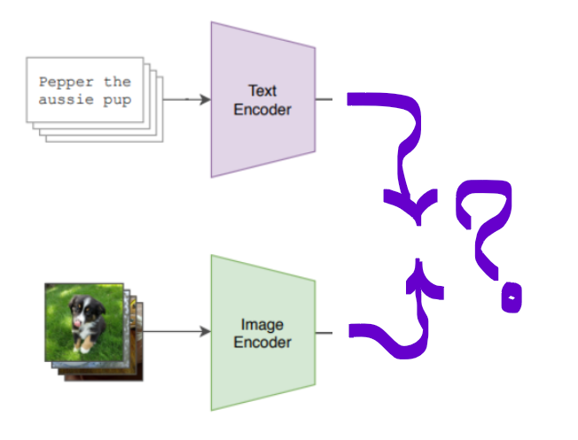
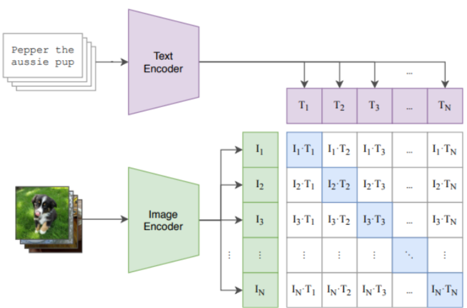
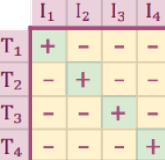
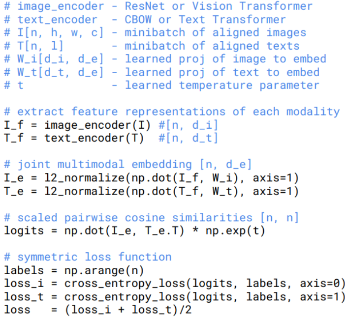

[In the previous note](vit.md), we looked at how the Vision Transformer works. With it, classification tasks can be solved quite easily (_as long as labels are available!_ 🙂). However, in this case we are limited to a fixed number of predefined classes.  
But we would really like to build a system capable of working with any text query.

To achieve this, we can turn to **contrastive learning** - an approach borrowed from [**metric learning**](https://habr.com/ru/companies/ods/articles/695380/). Here we learn a representation in which similar objects are close together (small distance), while dissimilar ones are far apart (large distance). The main idea of this approach is the following.

Imagine that we have one encoder to obtain embeddings from the input text description of an image, and another encoder to obtain embeddings from the image itself.

If we just take arbitrary encoders, their outputs will not correspond to each other. It is rather useless, for example, to measure the distance between text and image embeddings, since they belong to completely different embedding spaces (even if they have the same dimensionality).

Here is where contrastive pretraining comes to the rescue. We can actually train the image and text encoders simultaneously on image-text pairs. With the help of some tricks, this eventually leads to a shared embedding space for images and text captions.

## Trick 1: contrastive pretraining with all pairs in image-text batch

Suppose we have $$N$$ matching image-text pairs in a batch. CLIP’s goal is to figure out which image belongs to which text out of the $$N \times N$$ possible combinations.

To achieve this, CLIP learns a multi-modal embedding space by jointly training an image encoder and text encoder:
- maximize the cosine similarity of the image and text embeddings of the $$N$$ good pairs
- minimizing the cosine similarity of the embeddings of the $$N^2 − N$$ incorrect pairs

After training, it is possible to measure how close in meaning a given image is to a piece of text. The **image encoder** and **text encoder** are trained jointly but remain parameter-independent.

## Trick 2: InfoNCE loss from metric learning

Here special InfoNCE loss is using in training:

$$
-\sum_ilog{\frac{\exp(\frac{f(I_i, T_i)}{\tau})}{\sum_j\exp(\frac{f(I_i, T_j)}{\tau})}}
$$

where:

$$f$$ - function that measures similarity (in our case cos sim for embeddings from image and text encoders)

$$\tau$$ -  [tempreture](https://lukesalamone.github.io/posts/what-is-temperature/) parameter

$$I_i$$ - $$i$$th object (for example, image)

$$T_i$$ - $$i$$th object (for example, text description)

$$I_i, T_i$$ - positive pair

$$I_i, T_j$$ $$i \neq j$$ - negative pair

Positive and negative pairs

So, actually InfoNCE is Cross Entropy loss with inner $$softmax(similarity)$$.
[Good explanation about InfoNCE loss](https://ankeshanand.com/blog/2020/01/26/contrative-self-supervised-learning.html).

## Encoders

What are the encoders?:
- **Text Encoder** is Transformer DNN (similar to GPT-like models)
	- Final embedding is taken from the special EOS token (final token in the output sequence) 
- **Image Encoder** is described ViT

## Algorithm

See more in [CLIP paper](https://arxiv.org/pdf/2103.00020).