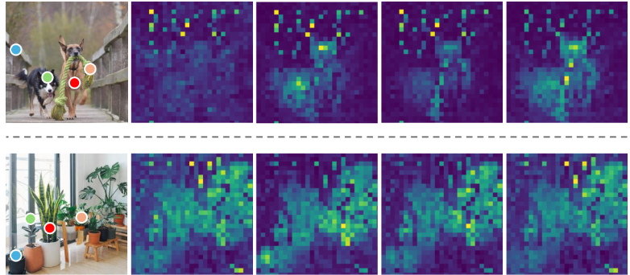

Imagine: you have a pretrained CLIP model based on ViT, and you’ve built a system that determines whether a text description matches the given photo. Perfect!

But then, unexpectedly, you’re asked to **locate** the objects in the image that correspond to the description. Your first thought might be: I need to create annotation masks for segmentation and train a new segmentation model (for example, like [CLIPSeg](https://arxiv.org/pdf/2112.10003)).

Now imagine you don’t need to do that at all. Instead, you simply replace a final layer with a **modified attention module**!

This is exactly the idea behind the [SCLIP](https://arxiv.org/pdf/2312.01597) paper and its approach. Let's dive in step by step!


## Refresh the basics

- [ViT structure](vit.md)
- [Attention maps of ViT](attention_maps.md)
- [CLIP structure](clip.md)

## Goal

Remake CLIP pipeline:
- from open vocabulary **classification to segmentation**
- with **NO** additional **training** 🙂

## CLIP attention map is invariant to object translation



Display of the attention maps of four points (marked in different colors) for each example.

According to its attention maps, the authors conclude that CLIP:
- **detects the presence** of objects
- but **does not accurately localize** them

"...we set 10 target categories including flamingo, water, land, with distractors such as sky, building, and person, but although CLIP accurately obtains the correct categories such as water and flamingo, it predicts the opposite localizations (i.e., predicts water for flamingos and flamingo for water and land)."

## SCLIP approach

To be able make a dense task like image segmentation "local representations should change accordingly to their spatial positions in an image".

The main idea: replace (for example, in final layer) original Self-Attention block to **Correlative Self-Attention (CSA) module**:


So, attention formula from:

$$
A = softmax \left( \frac{QK^T}{\sqrt{d_k}} \right)
$$

$$
Q = X W_q
$$

$$
K = X W_k
$$

$$
A = softmax \left( \frac{XW_qW_k^TX^T}{\sqrt{d_k}} \right)
$$

becomes:

$$
A = softmax \left( \frac{XW_rW_r^TX^T}{\sqrt{d_k}} \right)
$$

### Why CSA?

Changes described above really drastically help to perform segmentaion task. 

Reason: 
<div style="border:1px solid #ccc; padding:10px; border-radius:8px;">
"...the feature localization can be intuitively reflected by the magnitude of the diagonal elements of the" attention matrix
</div>

The element $$(i, i)$$ on the diagonal of the attention matrix in a ViT is the **weight with which a token attends to itself**.
- In self-attention, when updating its representation, a token can take into account **its own current state**.
- If $$(i,i)$$ is close to 1, it means that in this head the token almost completely “ignores” other tokens and mainly relies on its own features.
- If the weight is small, it means that this token is actively using information from other tokens.

The correlation (in this case cosine similarity, assuming the vectors are normalized) between $$\vec a_i = \vec x_i W_r$$ and $$\vec a_j = \vec x_j W_r$$ always reaches its maximum when $$i = j$$.

As a result, each local visual token receives a strong signal from its corresponding position, ensuring that the visual features remain well localized.


A schematic image illustrating approximate changes in attention values.

### What if take identical matrix as A?

Actually, even setting attention map to an identical matrix regardless of the input increases segmentation metrics!

"... [MaskCLIP](https://arxiv.org/pdf/2112.01071) uses this attention map in CLIP vision encoder’s last layer and obtains a non-trivial improvement in semantic segmentation..."

_This restriction of the attention matrix resembles the small receptive field in CNNs._
_Features in CNNs vs. ViTs:_
- ***In CNNs:***
    - *Each neuron sees only a local fragment of the image (its receptive field).*
    - *The receptive field grows with depth due to stacked convolutions and pooling, but information still propagates gradually - first from nearby pixels, then from more distant ones.*
    - *Even in deep CNNs, a “global view” of the image emerges only in the final layers.*
- ***In ViTs (with full self-attention):***
    - *Already in the **first layer**, each patch (token) can interact with **any other** patch, meaning the model has access to global context from the very beginning.*

But [MaskCLIP](https://arxiv.org/pdf/2112.01071) "approach strictly constrains the receptive field of local tokens, the model may easily over-focus on low-level features and thus produces noisy dense predictions".

### Neaby tokens with same semantic meaning

That is why it is important to use CSA formula instead of identical matrix.


"...CSA imparts high attention scores not only to $$a_i$$ itself but also to tokens that share similar semantic content"

## Recipe to change ViT

But how can we avoid retraining the vision encoder in CLIP?

1. The authors suggest using the "last or last several layers as a task-specific decoder head".
2. For attention, they propose using the following formula:

$$
A = softmax \left( \frac{XW_qW_q^TX^T}{\tau} \right) + softmax \left( \frac{XW_kW_k^TX^T}{\tau} \right)
$$

$$W_q$$ and $$W_k$$ are ready weights, **we don't need to retrain!**

It looks in code [in this way](https://github.com/wangf3014/SCLIP/blob/main/clip/model.py#L283C1-L313C27).
```python
q_attn = torch.bmm(q, q.transpose(1, 2)) * scale
k_attn = torch.bmm(k, k.transpose(1, 2)) * scale
attn_weights = F.softmax(q_attn, dim=-1) + F.softmax(k_attn, dim=-1)
```

**In SCLIP, instead of using the CLS token, patch tokens are taken!**
See [here](https://github.com/wangf3014/SCLIP/blob/main/clip_segmentor.py#L63).
```python
image_features = self.net.encode_image(img, return_all=True, csa=True)
image_features /= image_features.norm(dim=-1, keepdim=True)
image_features = image_features[:, 1:]
logits = image_features @ self.query_features.T
```

# Demo

I built a [Hugging Face Space to test SCLIP interactively](https://huggingface.co/spaces/IgorKuz/SCLIP-Demo).


