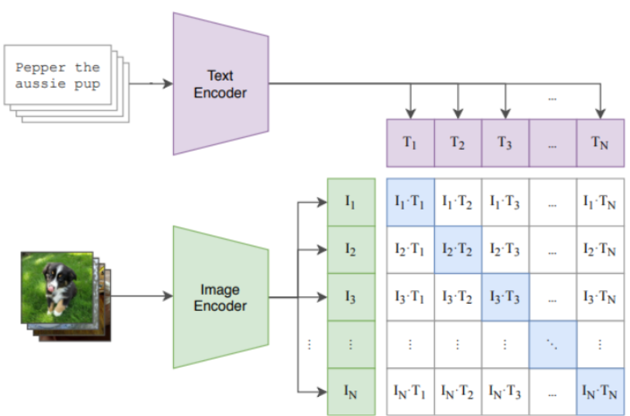
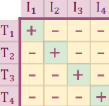

[In the note about CLIP model](/articles/clip.html) we see how contrastive learning could help to construct unite embeddings space for images and texts. Recall essential trick for this: using InfoNCE loss for batch of text-image pairs:

$$
- \frac{1}{2N} \sum^N_i \left( log \frac{exp^{\frac{1}{\tau} f(I_i, T_i)}}{\sum_j^N exp^{\frac{1}{\tau} f(I_i, T_j)}} + log \frac{exp^{\frac{1}{\tau} f(I_i, T_i)}}{\sum_j^N exp^{\frac{1}{\tau} f(I_j, T_i)}} \right)
$$

where:

$$f$$ - function that measures similarity (in our case cos sim for embeddings from image and text encoders)

$$N$$ - number of pairs in batch

$$I_i$$ - $$i$$th object (for example, image)

$$T_i$$ - $$i$$th object (for example, text description)

$$I_i, T_i$$ - positive pair

$$I_i, T_j$$, $$i \neq j$$ - negative pair

The first term is about **Image→Text** (find text description based on the image). For every image loss should help model to "choose" corresponding text description from N texts in batch. So, the loss is cross-entropy, where classses are elements of batch.

Similarly, the second term is about **Text→Image** (find image based on text description).

Let's see how this loss is modified in SiGLIP paper https://arxiv.org/pdf/2303.15343:

$$
-\frac{1}{N} \sum_i^N \sum_j^N log \frac{1}{1 + exp^{z_{ij}(-\frac{1}{\tau} f(I_i, T_j)+b)}}
$$

where:

$$
z_{ij} -  label for a given image and text input, which equals 1 if they are paired and −1 otherwise
$$

$$
b - dditional learnable bias term (many negatives dominates the los)
$$

[SiGLIP]()