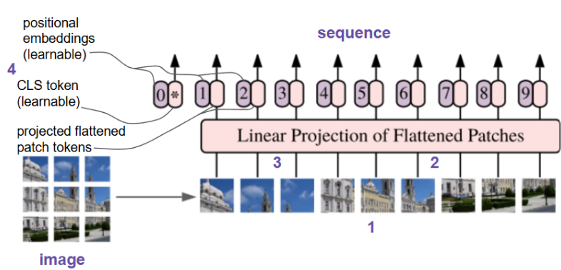
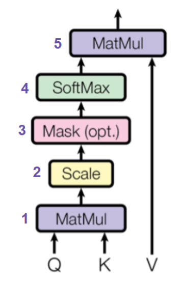
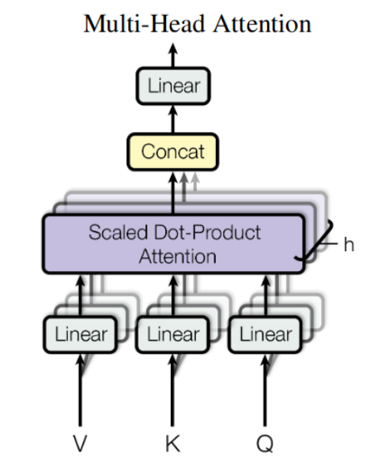
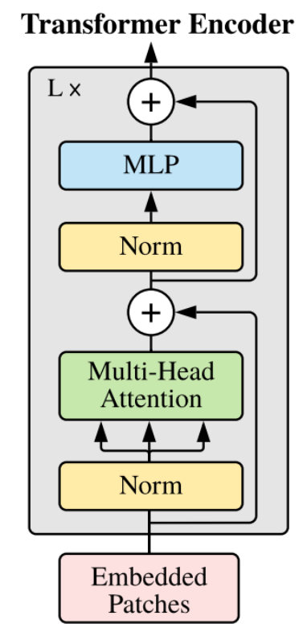
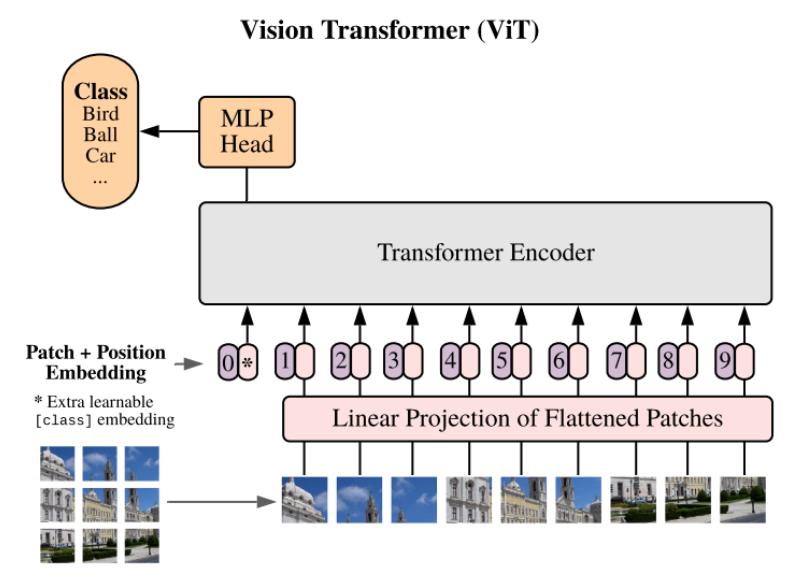

## Image to sequence

Let’s recall that modern deep neural networks (DNNs) based on transformers operate on **sequences**.  
A sequence can represent:
- text,
- time series,
- or even patches of an image(s).

In our case, we will focus on **images**. 
 
Before being processed by a transformer-based DNN, an image typically undergoes the following steps:
1. **Splitting into patches**: the image is divided into fixed-size patches.
2. **Flattening patches**: each patch is converted into a 1D vector.
3. **Linear projection**: each vector is mapped into a higher-dimensional embedding space (forming a _token_).
4. Adding learnable positional embeddings, learnable CLS token (trained during training and fixed during inference).

$$
X = \left[ \; \vec w_{CLS} \;; \; \vec x_p^1 \; W_{LP} \; ; \; ... \; ; \; \vec x_p^N \; W_{LP} \; \right] + W_{positional \; embs}
$$

$$\vec w_{CLS}$$ — learnable CLS token with shape $$1 \times D$$  
$$D$$ — dimension of embedding space  

$$H, W$$ — size of the input image  
$$P, P$$ — size of each patch  
$$N=\dfrac{HW}{P^2}$$ — number of patches  
$$\vec x_p^1, \ldots, \vec x_p^N$$ — flattened patches, each has shape \(1 \times P^2 C\)  

$$W_{LP}$$ — linear projection with shape $$P^2 C \times D$$  

$$W_{positional \; embs}$$ — learnable positional embeddings for each token, shape $$ (N+1) \times D $$

## Attention

The resulting sequence is then fed into the transformer model.  
The essential building block of a transformer is the **attention**. See original paper [Attention Is All You Need](https://arxiv.org/pdf/1706.03762).

Attention allows transformers to maintain an extremely long-term memory: the model can _attend to_ all tokens in the sequence simultaneously.

In our case, this means that through attention, the transformer can “see” all parts of the image at once (sees with the resolution of the patch size). 
*This is the key difference from CNN-based models, where the receptive field in the 
first layers limits the view to local regions.*

### Idea

The attention mechanism can be described in terms of a _soft_ key–value database lookup.

Imagine we have a key-value database (for example, a simple Python dictionary) and we issue a query that contains a spelling mistake.

We want to compare the query $$q$$ with every key $$k$$ in the database, and return a weighted sum of the values.
The weight assigned to each value should correspond to the probability that the user actually asked the associated key.

By computing the vector of probabilities as
$$
softmax \left( similarity(q, k) \right)
$$
and then taking the dot product of this probability vector with the vector of values $$v$$, we obtain a "corrected" value from the database that best matches the asked meaning of the query $$q$$.

This explaination was taken [from this article](https://habr.com/ru/articles/599703/).

Let's we have our sequence obtained from the input image:

$$
X \in \Bbb R^{N+1 \; \times \; D}
$$

$$N$$ - number of patches

$$D$$ - length of each input embedding (each input token)

### 0. Linear projection:

$$
Q = X W_Q
$$

$$
K = X W_K
$$

$$
V = X W_V
$$

$$X$$ - shape $$N+1 \; \times \; D$$

$$W_Q$$ - shape $$D \; \times \; D_h$$

$$W_K$$ - shape $$D \; \times \; D_h$$

$$W_V$$ - shape $$D \; \times \; D_h$$

*In ViT $$d_Q = d_K = d_V = D_h$$*

$$
D_h = \frac{D}{h}
$$

### 1. MatMul:

The input consists of the query matrix $$Q$$, the key matrix $$K$$, and the value matrix $$V$$, where each column represents a single query vector, key vector, or value vector, respectively.

Next, the **MatMul** block computes the dot products between each `(query, key)` pair:

$$
QK^T
$$

### 2. Scale:

The **Scale** block normalizes each dot product for numerical stability:

$$
\frac{QK^T}{\sqrt{d_K}}
$$

$$d_K$$ - dimension of matrix $$K$$

Why $$d_K$$ ?

From [Attention Is All You Need](https://arxiv.org/pdf/1706.03762):
*For large values of $$d_K$$, the dot products grow large in magnitude, pushing the softmax function into regions where it has extremely small gradients. To counteract this effect, we scale the dot products by $$\sqrt{d_K}$$.*

*In ViT $$d_K = D_h$$*

### 3. Mask:

The **Mask** block is optional. In ViT it is not used, since causality is not important here - on the contrary, we want the model to see the entire image! But causality is important for autoregressive transformers (predicting next token of the sequence) - mask is using in training.

### 4. Softmax:

Here, **Softmax** is applied to each vector of normalized dot products (corresponding to one query and different keys), transforming them into a probability distribution where the elements sum to 1.

$$
Attention = softmax \left( \frac{QK^T}{\sqrt{d_K}} \right)
$$

has shape $$N+1 \; \times \; N+1$$
### 5. MatMul:

The **MatMul** block, for each query vector in $$Q$$, returns a weighted sum of the value vectors $$V$$, with the weights given by the output of the **Softmax** block for that query.

So, the final formula:

$$
Attention\_res(Q, K, V) = softmax \left( \frac{QK^T}{\sqrt{d_K}} \right) V
$$

$$Attention\_res(Q, K, V)$$ has shape $$N+1 \; \times \; D_h$$

Good interpretantion of attention:

*The vanilla self-attention mechanism generate the target feature by the linear combination of all features which are weighted by the similarity between them*
(taken from [NAFNet paper](https://arxiv.org/pdf/2204.04676v1)).

Indeed,

$$
\vec a = \alpha_1 \;\vec v_1 \; + \; ... \alpha_{n_V} \; \vec v_{n_V}
$$

Where $$\alpha_1, ... , \alpha_{n_V}$$ are weights of closeness between $$Q$$ and $$K$$.

## Unite Attentions to heads: Multi-Head Self Attention (MHA)

Each head projects the input tokens into its own lower-dimensional subspace and computes attention **only within that subspace**.

$$
\begin{aligned}
\text{Head } 1: &\quad W^{(1)}_Q,\; W^{(1)}_K,\; W^{(1)}_V \\
\text{Head } 2: &\quad W^{(2)}_Q,\; W^{(2)}_K,\; W^{(2)}_V \\
\vdots & \\
\text{Head } h: &\quad W^{(h)}_Q,\; W^{(h)}_K,\; W^{(h)}_V
\end{aligned}
$$

Different projection matrices allow each head to “look at” different representations of the features.

### Concat

After heads concatination we again have features $$Z$$ with shape $$N+1 \times D$$ (we have $$h$$ heads and we chose $$D_h = D / 3$$)

### Linear

$$W_O$$​ - linearly combines all the features, allowing the model to integrate information extracted by different heads.  
Since each head focused on its own subspace of features, they need to be **merged back**.

$$
Z_{out \; from \; MSA} = Z \;W_O
$$

$$W_O$$ has shape $$D \times D$$

$$Z_{out \; from \; MSA}$$ has shape $$N+1 \times D$$

## Transformer encoder

Multi-Head Attention blocks unite to Transformer Encoder to get image features representation:

So, formally:

$$
X \in \Bbb R^{N+1 \; \times \; D}
$$

$$
Z_0 = X
$$

$$
Z_{l}^{'} = MHA(LN(Z_{l-1}))+Z_{l-1}, \;\;\;\; l = 1, ..., L
$$

$$
Z_{l} = MLP(LN(Z_l^{'}))+Z_l^{'}, \;\;\;\; l = 1, ..., L
$$

### Norm (LN)

As for normalization, in ViT Layer Normalization (LN) is using. 

Layer normalization operates over the features of each individual sample. This distinguishes it from batch normalization, which is widely applied in CNNs.

### MLP

Is just [multilayer perceptron](https://scikit-learn.org/stable/modules/neural_networks_supervised.html#multi-layer-perceptron).

## ViT overall structure

See more in [ViT paper](https://arxiv.org/pdf/2010.11929).

This model is widely using, for example, for image classification task. By CLS token features (that reflects overall info of image) you can decide (for example, with MLP head 🙂) what class of the input image.

But how is possible to make wider task - open vocabulary classification?